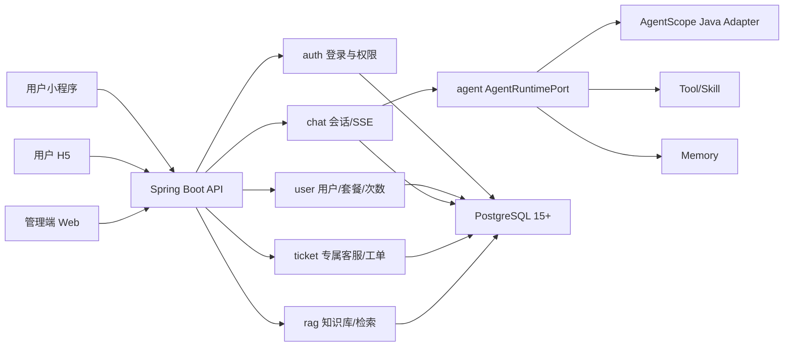
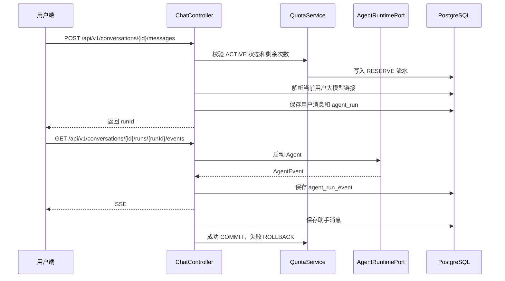

# 滴兔智能体技术架构设计说明书

## 1. 建设目标

“滴兔智能体”是滴兔知识产权有限公司的智能服务系统。系统以知识产权咨询为核心，提供用户智能问答、历史会话、套餐次数、专属客服工单和 RAG 知识维护能力。

本设计以 [01-功能清单与业务范围.md](01-功能清单与业务范围.md) 为功能基线。架构模块、接口、数据库、页面和验收均按功能编号追踪。

系统实现以下目标：

- 用户登录后进行多轮智能会话，对应 `AUTH-001`、`CHAT-001` 至 `CHAT-004`。
- 用户查看历史聊天记录并继续原会话，对应 `CHAT-005` 至 `CHAT-007`。
- 用户查看基础、Pro、Plus 三种套餐及剩余次数，对应 `USER-001`、`USER-002`。
- 用户查看不同类型专属客服并发起工单，对应 `CS-001`、`TICKET-001` 至 `TICKET-004`。
- 管理员登录管理端，完成用户注册、停用、启用、套餐次数分配，对应 `AUTH-001`、`ADMIN-USER-001` 至 `ADMIN-USER-004`、`ADMIN-QUOTA-001`。
- 管理员控制用户可用会话次数，对应 `ADMIN-QUOTA-002`、`ADMIN-QUOTA-003`。
- 管理员查看、分配、回复、关闭专属客服工单，对应 `ADMIN-TICKET-001` 至 `ADMIN-TICKET-006`。
- 管理员维护通用知识库和单一用户专属知识库，对应 `RAG-001` 至 `RAG-009`。
- 系统支持用户小程序、用户 H5、管理端 Web 三端访问。

## 2. 业务角色

| 角色 | 权限 |
|---|---|
| 普通用户 `USER` | 登录用户端、创建会话、查看聊天记录、查看套餐、消耗次数发起问答、创建和查看自己的工单 |
| 管理员 `ADMIN` | 登录管理端、管理用户、分配次数、维护套餐、配置用户大模型链接、处理工单、维护 RAG 知识 |
| 客服主管 `CS_MANAGER` | 登录管理端、查看和处理工单 |
| 知识库管理员 `RAG_ADMIN` | 登录管理端、维护通用知识库和用户专属知识库 |

`ADMIN` 拥有管理端全部能力。普通用户只能访问自己名下的会话、消息、工单和用户专属知识召回结果。

## 3. 功能到架构能力映射

| 功能编号 | 架构能力 | 后端包 | 前端页面 |
|---|---|---|---|
| `AUTH-001` 至 `AUTH-003` | 登录、Token、当前用户、鉴权 | `auth` | 登录页 |
| `USER-001`、`USER-002` | 套餐和剩余次数 | `user` | 套餐页、会话页顶部状态 |
| `CHAT-001` 至 `CHAT-008` | 会话、消息、SSE、历史记录 | `chat`、`agent` | 会话页、历史页 |
| `CS-001`、`TICKET-001` 至 `TICKET-004` | 专属客服和用户工单 | `ticket` | 专属客服页、工单详情页 |
| `ADMIN-USER-001` 至 `ADMIN-USER-005` | 用户管理 | `user`、`admin` | 用户管理页 |
| `ADMIN-QUOTA-001` 至 `ADMIN-QUOTA-003` | 次数分配、流水、扣减控制 | `user`、`chat` | 用户管理页、次数流水页 |
| `ADMIN-MODEL-001` 至 `ADMIN-MODEL-004` | 用户级大模型链接配置和连通性测试 | `user`、`agent`、`admin` | 用户模型配置页 |
| `ADMIN-TICKET-001` 至 `ADMIN-TICKET-006` | 工单处理 | `ticket`、`admin` | 工单列表页 |
| `RAG-001` 至 `RAG-009` | 知识库、文档、切片、检索 | `rag`、`agent` | RAG 知识库页、会话页 |
| `AGENT-001` 至 `AGENT-007` | AgentScope、Tool、Skill、Memory、事件 | `agent`、`chat` | 会话页 |
| `SEC-001` 至 `SEC-005` | 权限、归属校验、审计、上传安全 | `auth`、`common`、`infra` | 全部页面 |

## 4. 三端架构

| 端 | 技术 | 页面 |
|---|---|---|
| 用户小程序 | uni-app Vue 3 | 登录、会话、历史、套餐、专属客服、工单详情 |
| 用户 H5 | Vue 3 + TypeScript + Vite + Pinia + Element Plus | 登录、会话、历史、套餐、专属客服、工单详情 |
| 管理端 Web | Vue 3 + TypeScript + Vite + Pinia + Element Plus | 登录、用户管理、次数流水、用户模型配置、工单管理、RAG 知识库、套餐配置 |

前端使用一个 Monorepo：

```text
frontend/
  apps/
    h5/
    admin/
    miniprogram/
  packages/
    api-client/
    types/
    ui-shared/
```

执行规则：

- `packages/types` 存放后端 DTO 对应的 TypeScript 类型。
- `packages/api-client` 封装 HTTP、Token、SSE、错误码处理。
- H5 和小程序共享用户端业务类型。
- 管理端复用同一套登录态、错误处理和分页模型。

## 5. 后端总体架构

后端使用单 Maven 工程和单 Spring Boot 应用，不拆分多个 Java 子模块。

```text
backend/
  pom.xml
  src/
    main/
      java/
        com/ditu/agent/
          DituAgentApplication.java
          auth/
          user/
          chat/
          agent/
          rag/
          ticket/
          admin/
          infra/
          common/
      resources/
        application.yml
        db/migration/
    test/
      java/
        com/ditu/agent/
```

Java 包职责：

| 包 | 职责 |
|---|---|
| `common` | 统一响应、异常、错误码、分页、审计上下文、时间工具 |
| `auth` | 登录、Token、Spring Security 配置、当前用户上下文 |
| `user` | 用户、角色、套餐、次数、次数流水 |
| `chat` | 会话、消息、Agent run、SSE 事件输出 |
| `agent` | `AgentRuntimePort`、AgentScope 适配、Tool、Skill、Memory、HITL |
| `rag` | 知识库、文档、切片、Embedding、权限过滤检索 |
| `ticket` | 专属客服配置、工单、工单消息、状态流转 |
| `admin` | 管理端用例编排 |
| `infra` | PostgreSQL、MyBatis Plus、文件存储、外部模型客户端 |

分层规则：

- Controller 只处理 HTTP 参数、认证上下文、响应结构。
- Application Service 编排业务流程。
- Domain Service 承载次数扣减、工单状态、RAG 权限等业务规则。
- Mapper 使用 MyBatis Plus 和明确 SQL。
- Controller 与 Application Service 不引用 AgentScope 具体类。
- AgentScope 只出现在 `agent` 包的 Adapter 内部。
- 代码必须补充业务注释，注释覆盖关键类、复杂方法、Mapper SQL、事务边界、权限边界、次数扣减、RAG 权限过滤、模型链接解析、SSE 事件语义和异常处理原因。
- 注释必须解释业务含义，不使用没有业务价值的机械注释。

## 6. 总体调用关系



## 7. 认证与权限

### 7.1 登录

- 系统采用账号密码登录。
- 密码使用 BCrypt 存储。
- 登录成功返回 `accessToken` 和 `refreshToken`。
- H5、小程序、管理端使用同一登录接口。
- 管理端接口根据角色进行权限校验。

### 7.2 权限控制

- 用户端接口要求 `USER`。
- 管理端用户管理、套餐配置、次数分配、用户大模型链接配置要求 `ADMIN`。
- 工单处理要求 `ADMIN` 或 `CS_MANAGER`。
- RAG 维护要求 `ADMIN` 或 `RAG_ADMIN`。
- 用户访问会话、消息、工单时必须校验 `resource.user_id = current_user.id`。
- RAG 检索必须执行 `GLOBAL OR owner_user_id = current_user.id` 过滤。

## 8. 用户端业务流程

### 8.1 登录与首页

1. 用户输入账号密码。
2. 后端校验账号状态。
3. 账号状态为 `ACTIVE` 时返回 Token 和用户信息。
4. 前端进入会话页。
5. 前端调用 `/auth/me` 获取套餐、总次数、已用次数、剩余次数。

### 8.2 多轮会话



会话规则：

- 一个用户拥有多个会话。
- 一个会话包含多条消息。
- 用户发送一次消息创建一个 `agent_run`。
- `agent_run` 记录本次运行使用的 `model_config_id` 和 `model_name`。
- 当前用户存在启用的大模型链接配置时，Agent run 使用用户级配置。
- 当前用户没有启用的大模型链接配置时，Agent run 使用平台默认模型链接。
- SSE 事件落库到 `agent_run_event`。
- Agent 成功完成后扣减 1 次。
- Agent 失败、超时、取消时回滚预占次数。

### 8.3 聊天记录

- 会话列表按 `updated_at DESC` 排序。
- 消息列表按 `sequence_no ASC` 排序。
- 用户只能查看自己的会话和消息。
- 用户进入历史会话后继续发送消息，系统沿用同一个 `conversation_id`。

### 8.4 套餐查看

系统固定提供三种套餐：

| 套餐 | 定位 | 权益 |
|---|---|---|
| 基础 | 低频咨询用户 | 通用知识问答、基础次数 |
| Pro | 中小企业用户 | 更多次数、通用知识问答、用户专属知识库 |
| Plus | 高频和重点客户 | 高次数、用户专属知识库、优先客服 |

套餐页展示套餐名称、权益、月度次数、是否支持用户专属知识库、是否支持优先客服。

### 8.5 专属客服与工单

专属客服配置包含：

| 字段 | 说明 |
|---|---|
| 名称 | 展示给用户的客服名称 |
| 角色 | 客服承担的业务角色 |
| 定位 | 客服解决的问题范围 |
| 简介 | 用户端展示说明 |
| 服务类型 | 商标、专利、版权、综合咨询 |

工单规则：

- 用户从专属客服页创建工单。
- 用户从会话页转人工时创建工单。
- 工单归属当前用户。
- 管理员和客服主管在管理端处理工单。
- 工单关闭后不接受新回复。

## 9. 管理端业务流程

### 9.1 用户管理

管理员完成以下操作：

- 注册用户。
- 停用用户。
- 启用用户。
- 查看用户套餐和剩余次数。
- 调整用户套餐。
- 分配或扣减用户次数。
- 查看用户次数流水。
- 配置用户大模型链接。

所有用户状态变更和次数变更写入 `audit_log`。

### 9.2 次数控制

次数字段：

- `quota_total`：用户总次数。
- `quota_used`：用户已消耗次数。
- `remaining_quota = quota_total - quota_used`。

扣减流程：

1. 用户发送消息时校验 `remaining_quota > 0`。
2. 系统写入 `quota_ledger` 的 `RESERVE` 流水。
3. Agent run 成功完成后写入 `COMMIT` 流水并增加 `quota_used`。
4. Agent run 失败、超时、取消时写入 `ROLLBACK` 流水，不增加 `quota_used`。
5. 管理员手工调整总次数时写入 `ADJUST` 流水。

### 9.3 用户大模型链接配置

管理员在用户详情中维护用户大模型链接。配置内容包括：

| 字段 | 说明 |
|---|---|
| 配置名称 | 管理端识别名称 |
| 接口地址 | 大模型服务基础地址 |
| 模型名称 | 调用的模型名称 |
| 鉴权方式 | `NONE`、`API_KEY`、`BEARER` |
| 密钥 | 加密存储，管理端脱敏展示 |
| 启用状态 | 启用后该用户会话使用此配置 |
| 测试状态 | 最近一次连通性测试结果 |

运行时解析规则：

1. 用户发送消息并通过次数校验。
2. `ModelConnectionResolver` 查询当前用户启用的模型链接。
3. 查询到启用配置时使用用户级配置。
4. 查询不到启用配置时使用平台默认配置。
5. 模型链接调用失败时 `agent_run.status` 变为 `FAILED`，次数回滚。
6. 管理员保存、测试、停用模型链接均写入 `audit_log`。

### 9.4 工单管理

管理端工单状态：

```text
OPEN -> PROCESSING -> RESOLVED -> CLOSED
OPEN -> PENDING -> PROCESSING
RESOLVED -> PROCESSING
```

处理规则：

- 新工单状态为 `OPEN`。
- 管理员分配处理人后状态进入 `PROCESSING`。
- 客服回复后保持 `PROCESSING`。
- 问题处理完进入 `RESOLVED`。
- 用户确认或管理员关闭后进入 `CLOSED`。
- `CLOSED` 状态禁止追加消息。

### 9.5 RAG 知识维护

知识库类型：

| 类型 | 数据范围 | 检索权限 |
|---|---|---|
| `GLOBAL` | 平台通用知识 | 所有用户 |
| `USER` | 单一用户专属知识 | 仅 `owner_user_id` 对应用户 |

处理流程：

1. 管理员创建知识库。
2. 管理员上传文档。
3. 系统解析文档。
4. 系统切片并生成 Embedding。
5. 系统写入 `rag_chunk`。
6. 用户提问时系统检索 `GLOBAL` 和当前用户的 `USER` 知识。
7. Agent 使用召回片段生成回答。
8. SSE 输出 `rag.context` 事件。

## 10. SSE 事件契约

| 事件 | 含义 |
|---|---|
| `run.started` | Agent run 开始 |
| `message.delta` | 助手回复增量 |
| `message.done` | 助手回复完成 |
| `rag.context` | 本次回答使用的知识片段 |
| `tool.call` | 工具调用开始 |
| `tool.result` | 工具调用完成 |
| `hitl.required` | 需要人工处理 |
| `quota.updated` | 次数结果更新 |
| `error` | 运行错误 |
| `run.completed` | Agent run 完成 |

SSE 规则：

- `event` 使用上表事件名。
- `id` 使用 `agent_run_event.sequence_no`。
- `data` 使用 JSON。
- 后端支持 `Last-Event-ID` 补发事件。
- 前端收到 `message.delta` 后追加展示。
- 前端收到 `message.done` 后以完整内容覆盖最终文本。

## 11. AgentScope Java 集成

后端采用 AgentScope Java 官方稳定依赖：

```xml
<dependency>
  <groupId>io.agentscope</groupId>
  <artifactId>agentscope</artifactId>
  <version>1.0.12</version>
</dependency>
```

集成规则：

- `agent` 包定义 `AgentRuntimePort`。
- `chat` 包通过 `AgentRuntimePort` 启动 Agent。
- `AgentScopeRuntimeAdapter` 实现 `AgentRuntimePort`。
- `ModelConnectionResolver` 在每次 Agent run 前解析当前用户的大模型链接。
- 用户级模型链接启用时覆盖平台默认模型链接。
- Controller、Service、Mapper 不引用 AgentScope 类。
- Agent 输出统一转为 `AgentEvent`。
- `AgentEvent` 同时用于落库和 SSE 输出。

Agent 抽象：

| 抽象 | Java 名称 | 职责 |
|---|---|---|
| Agent | `AgentRuntimePort` | 接收用户消息和上下文，返回流式事件 |
| Tool | `ToolRegistry` | 注册套餐查询、RAG 检索、工单创建工具 |
| Skill | `SkillDefinition` | 封装商标、专利、版权、综合咨询技能 |
| Memory | `ConversationMemoryStore` | 读取历史消息并构造上下文 |
| Model Connection | `ModelConnectionResolver` | 按用户解析大模型接口地址、模型名称和鉴权信息 |
| Event | `AgentEvent` | 表达增量文本、工具、RAG、错误、完成状态 |
| HITL | `HitlGateway` | 转人工和工单创建 |

## 12. RAG 检索规则

检索 SQL 必须包含以下权限条件：

```sql
AND (
  rc.scope = 'GLOBAL'
  OR (rc.scope = 'USER' AND rc.owner_user_id = :currentUserId)
)
```

RAG 片段进入 Agent 前必须携带：

- `collectionId`
- `documentId`
- `chunkId`
- `score`
- `snippet`

普通用户端只展示文档名称和摘要，不展示服务器文件路径。

## 13. 部署架构

```text
Nginx/Ingress
  -> backend Spring Boot jar
  -> h5 static files
  -> admin static files
  -> miniprogram API

PostgreSQL 15+
File Storage
```

后端环境变量：

| 变量 | 说明 |
|---|---|
| `SPRING_DATASOURCE_URL` | PostgreSQL 地址 |
| `SPRING_DATASOURCE_USERNAME` | PostgreSQL 用户 |
| `SPRING_DATASOURCE_PASSWORD` | PostgreSQL 密码 |
| `DITU_AUTH_TOKEN_SECRET` | Token 签名密钥 |
| `DITU_DEFAULT_MODEL_BASE_URL` | 平台默认大模型接口地址 |
| `DITU_DEFAULT_MODEL_NAME` | 平台默认大模型名称 |
| `DITU_DEFAULT_MODEL_AUTH_TYPE` | 平台默认模型鉴权方式 |
| `DITU_DEFAULT_MODEL_API_KEY` | 平台默认模型密钥 |
| `DITU_EMBEDDING_MODEL` | Embedding 模型名称 |
| `DITU_EMBEDDING_DIMENSION` | Embedding 维度 |
| `DITU_FILE_STORAGE_ROOT` | 文档存储根路径 |

## 14. 观测与审计

系统日志必须包含：

- `traceId`
- `userId`
- `conversationId`
- `runId`
- `modelConfigId`
- `ticketId`

Actuator 暴露：

- `/actuator/health`
- `/actuator/metrics`

审计覆盖：

- 用户注册、停用、启用。
- 套餐调整。
- 次数调整。
- 用户大模型链接保存、测试、停用。
- 工单分配、关闭。
- RAG 文档上传、禁用、重建索引。
